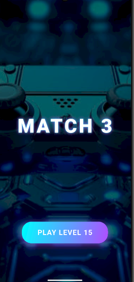
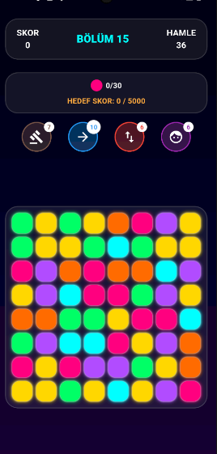
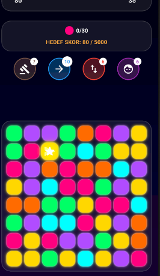

# 🎮 Match-3 Puzzle Game


A highly polished, fully functional Match-3 puzzle game built entirely with Flutter. This project demonstrates advanced state management, complex 2D matrix manipulation, custom animations, and cross-platform mobile game development practices.

## ✨ Key Features

* **🧠 Smart Idle Hint System:** An intelligent algorithm that simulates possible moves (swipes) in the background. If the user is idle for 5 seconds, it identifies a valid match-3 move or a special tile and triggers a beautiful pulsing star animation to guide the player.
* **🚀 Special Power-Ups & Combos:** Includes interactive boosters (Royal Hammer, Arrow, Cannon, and Jester Hat). Swapping two special tiles triggers unique cinematic explosion combinations.
* **🎨 Custom Particle & UI Animations:** Features highly responsive UI elements using `TweenAnimationBuilder`, `AnimatedScale`, and `AnimatedPositioned` to create satisfying swelling, exploding, and glowing tile effects.
* **💾 Persistent Game State:** Utilizes `shared_preferences` to save the player's level progress, score, and collected items locally. The dynamic Start Screen automatically detects and displays the user's current level.
* **⚙️ Scalable Architecture:** Clean code structure separating UI components (Animated Board, Start Screen) from business logic (Game Manager, Match Algorithms).

## 📸 Screenshots

| Start Screen | Gameplay | Smart Hint System |
| :---: | :---: | :---: |
|  |  |  |

## 🛠️ Tech Stack & Libraries

* **Framework:** Flutter (Dart)
* **State Management:** Provider / `ChangeNotifier`
* **Local Storage:** `shared_preferences`
* **UI/UX:** Native Flutter Animation Controllers & Custom Paints

## 🚀 Getting Started

To test this project locally on your machine, follow these steps:

1. **Clone the repository:**
   ```bash
   git clone https://github.com/akdenizenes/flutter-match3-game.git

